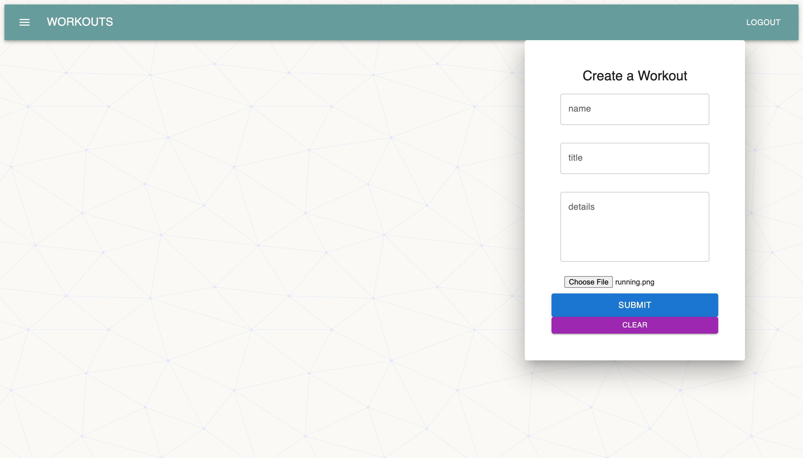
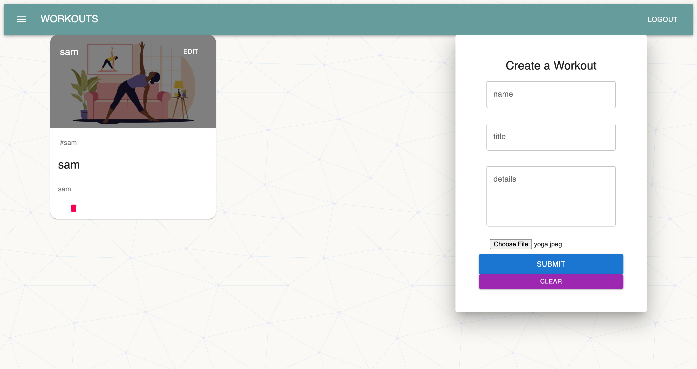
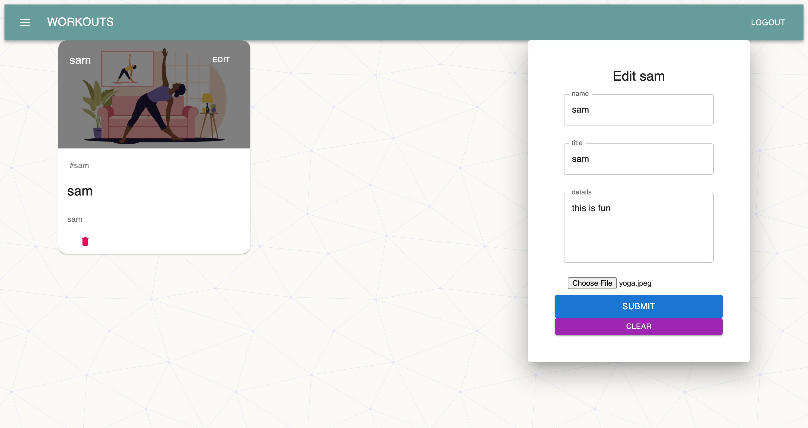

  # Title:
  Fit-App
  

  # Table of Contents: 
  * [Project Description](#description)
  * [Installation](#installation)
  * [Usage](#usage)
  * [License](#license)
  * [Test](#test)
  * [Questions](#questions)
  
  # Description:
   I’m samuel kahura, fit helps you track your everyday workouts/training . I want the average user to be empowered and inspired to live a healthier active life.
  # Installation:
  Clone the project onto your computer, and run npm install in the root directory, in the client directory, and in the server directory.
  # Usage:
  
  ## create a workout 
  
  ## post it!
  
   ## make changes to it
  

  # Technologies used
  React, 
  Node.js, 
  Express,  
  MongoDB, 
  Mongoose,
  Express, 
  Robo3t, 
  Material UI,
  Axios,
  React File Base64
 
  

  # Links
 [Deployed link](https://shrouded-mesa-55295.herokuapp.com/)

 [Repository](https://github.com/snk-99/fit-app)
  # Questions
  Contact me for any questions!!
  * Contact Email: kahurasamuel@gmail.com
  * GitHub Profile: [snk-99](https://github.com/snk-99snk-99)

